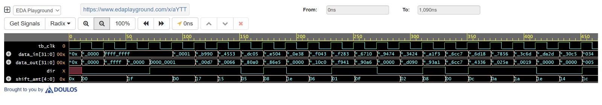

# 32-bit Barrel Shifter — RTL Design & UVM Verification

**Designer:** Divya Gupta | EE-VLSI | JIIT Noida (23118049)
**Simulator:** Cadence Xcelium 25.03 | UVM 1.2
**EDA Playground:** https://www.edaplayground.com/x/aYTT

---

## Project Overview

A 32-bit combinational barrel shifter with complete UVM-based functional verification. Supports logical left and right shift operations (0 to 31 positions) with coverage-driven methodology and SystemVerilog assertions.

---

## DUT Specifications

| Parameter | Value |
|-----------|-------|
| Data width | 32 bits |
| Shift amount | 5 bits (0 to 31) |
| Direction | Left (0) / Right (1) |
| Design type | Combinational MUX tree |
| Language | SystemVerilog |

---

## UVM Testbench Architecture

The testbench follows standard UVM layered architecture:

- **Test** — top level controller, launches sequences
- **Environment** — integrates agent and scoreboard
- **Write Agent (ACTIVE)** — driver + monitor + sequencer
- **Scoreboard** — reference model and functional checker
- **Coverage** — covergroups with cross coverage

---

## Verification Strategy

### Sequences

**seq_random** — 50 constrained random transactions covering broad input space

**seq_corner** — directed corner cases:
- shift = 0 (no shift)
- shift = 31 (maximum shift)
- data_in = 0x00000000
- data_in = 0xFFFFFFFF
- Both left and right directions

### Coverage Groups

**cg_input** — input side coverage:
- SHIFT_VAL — bins: NO_SHIFT, LOW_SHIFT, MID_SHIFT, HI_SHIFT, MAX_SHIFT
- DIR_VAL — bins: LEFT, RIGHT
- SHIFT_DIR_CROSS — cross coverage of shift x direction

### SystemVerilog Assertions

- **shift_zero_check** — when shift_amt=0, data_out must equal data_in
- **max_left_shift_check** — shift=31 left shift correctness verified
- **no_x_output** — data_out never unknown when inputs are valid

---

## Simulation Results

| Metric | Result |
|--------|--------|
| Total transactions | 54 |
| PASS | 54 |
| FAIL | 0 |
| UVM_ERROR | 0 |
| UVM_FATAL | 0 |
| Functional Coverage | 100% |
| Simulator | Cadence Xcelium 25.03 |

---

## Waveform

---

## Repository Structure

    barrel-shifter-32bit-uvm/
    ├── rtl/
    │   └── barrel_shifter.sv
    ├── tb/
    │   ├── bsr_if.sv
    │   ├── write_xtn.sv
    │   ├── bsr_pkg.sv
    │   ├── wr_config.sv
    │   ├── env_config.sv
    │   ├── wr_driver.sv
    │   ├── wr_monitor.sv
    │   ├── wr_sequencer.sv
    │   ├── wr_agent.sv
    │   ├── wr_sequence.sv
    │   ├── scoreboard.sv
    │   ├── environment.sv
    │   ├── test.sv
    │   └── top.sv
    └── sim/
        └── run.do

---

## Tools Used

| Tool | Purpose |
|------|---------|
| Cadence Xcelium 25.03 | UVM Simulation |
| EDA Playground | Cloud simulation platform |
| Intel ModelSim 20.1 | Local simulation |
| GitHub | Version control |

---

## Key Concepts

**Why combinational design?** Barrel shifter is a pure MUX tree — 5 layers of multiplexers for 32-bit. No sequential state, no feedback. Clock would only add latency with no functional benefit.

**Why UVM_ACTIVE write agent?** Input side generates stimulus — driver needed. Output side is passive — only monitor required.

**Why cross coverage?** Individual coverpoints only confirm that shift=31 was tested and RIGHT direction was tested separately. Cross coverage confirms they were tested together — which is the critical corner case.

**Why 100% coverage does not mean bug-free?** Coverage confirms scenarios were exercised. Bugs are caught by scoreboard comparison and assertions — these work together for complete verification.

Coverage confirms scenarios were exercised. Bugs are caught by scoreboard comparison and assertions — these work together for complete verification.
